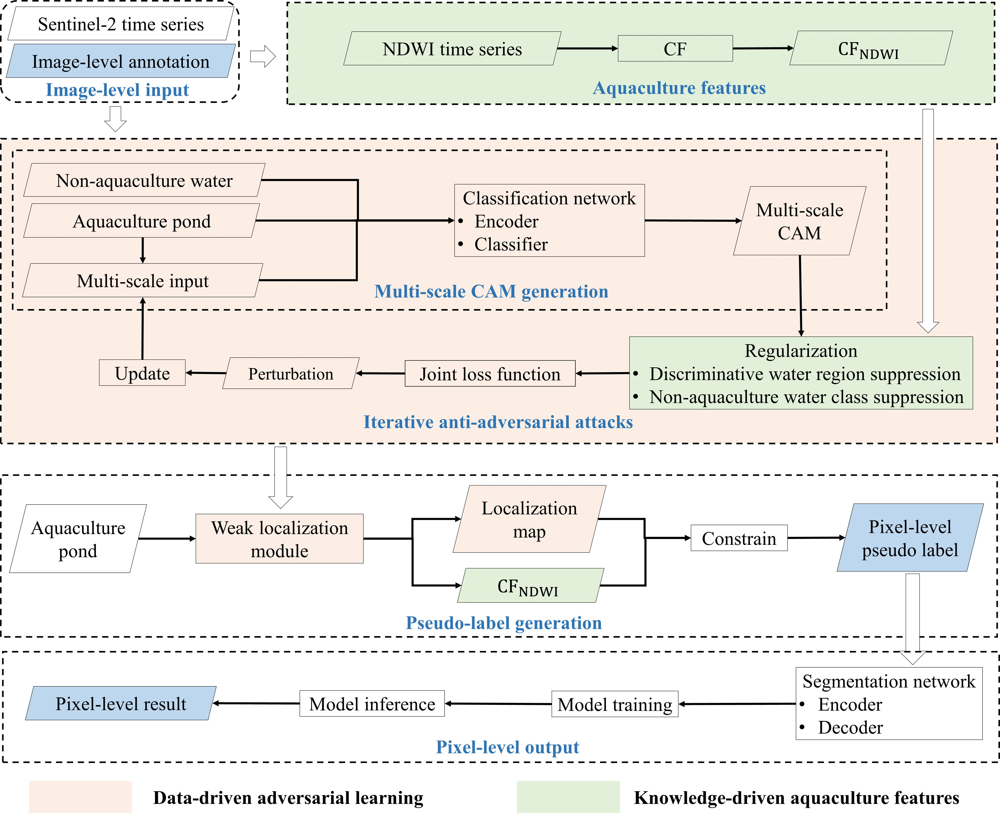

# From image-level to pixel-level labeling: A weakly-supervised learning method for identifying aquaculture ponds using iterative anti-adversarial attacks guided by aquaculture features
This repository contains the pytorch codes and trained models described in the following paper:

Title: From image-level to pixel-level labeling: A weakly-supervised learning method for identifying aquaculture ponds using iterative anti-adversarial attacks guided by aquaculture features

Authors: [Boyi Li](https://www.researchgate.net/profile/Boyi_Li7), Adu Gong *, Jiaming Zhang, and Zexin Fu.

Paper link: [https://doi.org/10.1016/j.jag.2024.104023](https://doi.org/10.1016/j.jag.2024.104023)

## Overview

## Performance

Semantic segmentation results using U-Net with different backbones.

Performance of different weakly-supervised methods on the test set.

| Method               | OA    | Precision | Recall | F1    | IoU   |
|----------------------|-------|-----------|--------|-------|-------|
| [AdvCAM](https://github.com/jbeomlee93/AdvCAM)               | 0.570 | 0.471     | 0.916  | 0.617 | 0.450 |
| [AMR](https://github.com/JayQine/AMR)                  | 0.531 | 0.450     | *0.967*  | 0.609 | 0.443 |
| [DWSLNet](https://github.com/Mr-catc/DWSLNet)              | 0.584 | 0.481     | 0.844  | 0.598 | 0.433 |
| [MSWS](https://github.com/lauraset/MSWS)                 | 0.572 | 0.461     | 0.743  | 0.534 | 0.381 |
| Ours (CAM)           | 0.618 | *0.935*     | 0.504  | 0.650 | 0.485 |
| Ours (Pseudo-label)  | *0.837* | 0.830     | 0.737  | *0.775* | *0.636* |

## Usage

### Dataset Preparation

Please view [preprocessing.ipynb](step/preprocessing.ipynb)

### Run

Please view [run_sample.ipynb](step/run_sample.ipynb)
